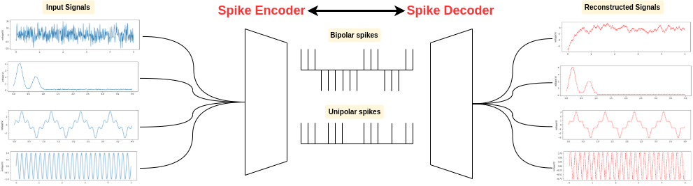

# Spike Encoding tutorial



Run ```pip install -r requirement.txt```

Launch ``` jupyter notebook SpikeEncoding.ipynb```

<!-- ref: https://github.com/JuSquare/SpikeCoding/blob/main/SpikeCodingPython/EncodingSchemes.py -->
